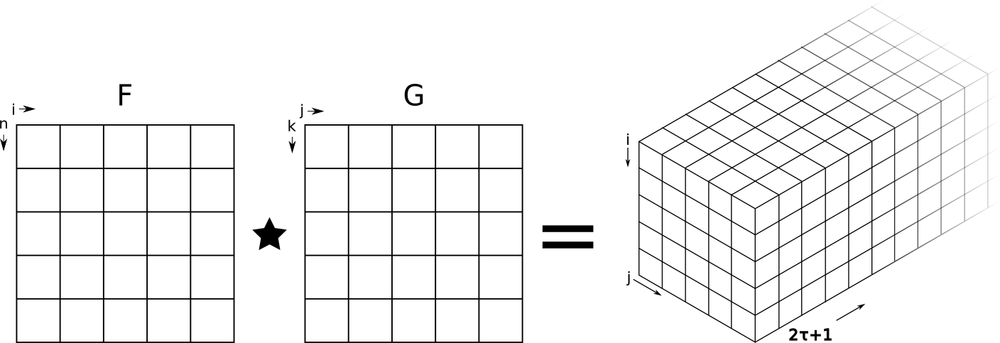
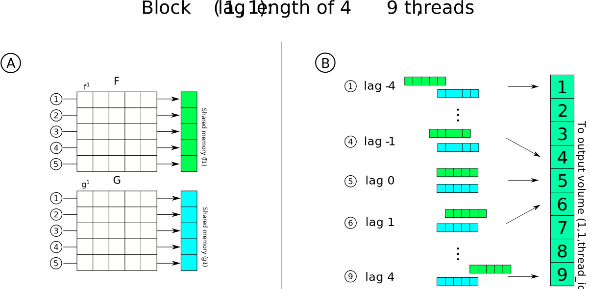

# Code structure and design


The code is designed around the idea of providing a generalized kernel that can be run on any accelerator. The KernelAbstractions.jl package is used to write
the kernels. 


## Assumptions

As of now there are two main assumptions:

1. Signals in the input matrices must have the same length
2. Signals must have a power of 2 n of samples.


This is caused both by present limitations in KernelAbstractions (i.e. it is not possible to define dynamic shared memory) and by the fact that power of two elements work nicely with thread scheduling in GPUs. Because of this, 6 kernels are provided that are chosen depending on the length of the signals.   


## Kernel design

### About Correlation

Correlation (``C``) is the sliding dot product between two functions (``f(t)`` and ``g(t)``), measuring their similarity in function of a time lag (``\tau``). When such functions are continuous, the cross correlation can be expressed as  

```math
f\star g = c(\tau) = \int_{-\infty}^{\infty} f(t) g(t+\tau) dt
```


When the two functions are discrete with ``n`` numbers of elements, time and lag are treated as indices (``a`` and ``l`` respectively)

```math
f\star g = c(\tau) = \sum_{a=1}^{n} f_a\times g_{a+l}
```


Given a matrix (``\textbf{F}``) of ``i`` vectors (``\textit{f}``) of length ``n`` ``\textbf{F} = (f^1, f^2, ..., f^i)`` and a second matrix (``\textbf{G}``) of ``j`` vectors (``\textit{g}``) of length ``k`` ``\textbf{G} = (g^1, g^2, ..., g^j)``, where each vector is symmetrically correlated within given length ``\tau``, the output of ``F \star G`` is a volume of size ``(i, j, 2\tau+1 )``. 




The correlation coefficient (``cc``) for the given signal pair is defined as the absolute maximum of the correlation function with ``cc \in (-\infty, +\infty)`` and has a corresponding lag value (``\tau_{max}``) that indicates where two signals are best aligned. Since such an open interval is not very useful for comparing different signals, the normalized correlation coefficient (``\textit{ncc}``) is often used 

```math 
ncc = \frac{cc}{||f||\cdot||g||} 
```

Thus the (normalized) correlation coefficient and lag matrices (**(N)CC**, **L**) will be both of size ``(i,j)`` and contain the _ncc_ and _lag_ value for the ith and jth signal pair.


### Kernel description

Each i,j correlation is independent from the others thus each ith, jth signal pair can be processed in parallel. Moreover, correlation in the end a sliding dot product where each dot product is independent from the other. Thus, for each signal pair there are n lags operations ($n_l$) that can also be carried out in parallel.

The inputs must be structured such that each signal corresponds to a column of the input matrix. $i$x$j$ blocks are lunched as a 2D grid (i.e. using 2D indexing) where the **x** block index represents the columns of matrix **F**, while the **y** block index represents the columns of matrix **G**.  

Each block has a certain amount of threads that carry out two tasks. First, each thread reads and loads in parallel each element of vectors $f^x$ and $g^y$ to shared memory.  Once all data is loaded, the same threads carry out the sliding dot product. Each thread is responsible for calculating one or more lagged dot products (using grid striding if necessary) and to save the dot product result to the output.





To calculate the correlation coefficient and lags then the absolute maximum values of each correlogram is defined (along with the index - ``\tau``). The sign is preserved to define also anti-correlation (e.g. slip reversal).

### Memory and Cross correlation


Memory on GPUs is always a limit. To calculate the memory required to launch the kernel the following simple formula can be used:


```math
T_{mem} = (i * n + j * k + i * j * (2\tau + 1)) * 4  
```

4 is the bytesize for single precision, use 8 for double. 
In cases of cross correlation (i.e. ``A\star A``) then it is possible to decrease the memory footprint by a bit more than half because of symmetry of the output. 


