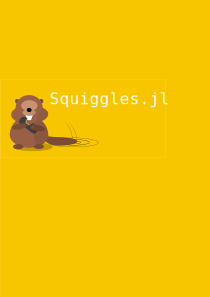

Welcome to Squiggles! 
Squiggles.jl is a Julia package to accelerate 1D cross correlations of seismic signals using GPUs! 

# Functions

```@docs
used_backend
```

```@docs
get_available_platforms
```

```@docs
get_available_GPUplatforms
```

```@docs
use_CPUbackend
```

```@docs
use_GPUbackend
```


